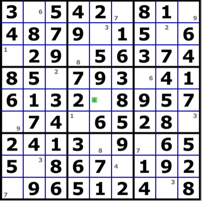
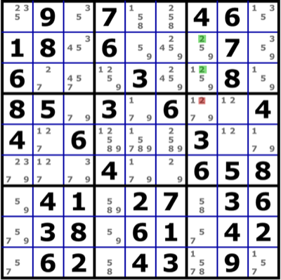
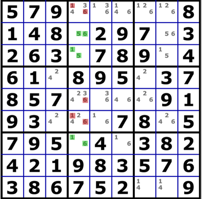
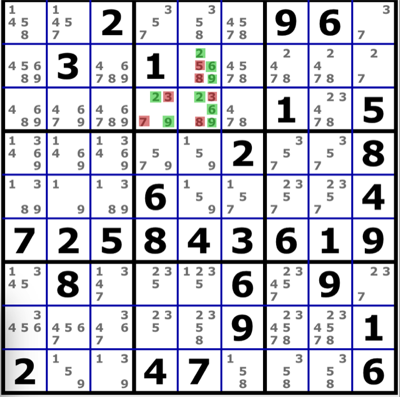

# rustdoku
Logical Sudoku solver in Rust.

**NOTE**: I am not in the slightest bit interested in solving *every* Sudoku puzzle. What I am interested in doing here is in building
up a repertoire of logical techniques and patterns that are capable of solving the vast majority of even very difficult puzzles.

Many of these techniques will be infeasible for human solvers, but human solving is not the goal here. My aim is to develop a small set
of heuristics that can be used to find logical solutions to Sudoku puzzles which meet two goals:

* The solve should be linear - it can be followed step-by-step without having to remember previous steps.

* The solve must be verifiable by a human with sufficient understanding of the techniques involved.

# Patterns included so far

## Full house

This occurs when only one cell in a row, column or block remains empty. Although this is subsumed by both other types of single below,
it's much easier to spot than the general case.

In this example, there is only one empty cell in the central row, into which the value 4 can be placed.

## Hidden single

This occurs when a particular value can only go in one position within a region (row, column or block).

In this grid, the only position in the top-left block that can hold the value 1 is R1C2.

## Naked single

When a cell can only hold a single value, that value can be placed in the cell.

In this grid, R5C5 can only take the value 5.

## Pointing

When all cells within a block that can hold a particular value also share a row or column, that value can be eliminated from other cells
in that row / column.

In this example puzzle, all occurrences of the digit 2 within the third block are also in column 7. This means that the candidate 2 can
be eliminated from R4C7.

## Claiming

When all cells within a row or column that can hold a particular value also share a block, that value can be eliminated from other cells
in that block.

In this example, all occurrences of the digit 3 within row 6 lie within the central block, so the other occurrences of 3 within that
block can be removed.

## Naked subsets

When a group of n cells within a single region have, between them, only n candidates, we can conclude that they must hold those
candidates in some order, and so eliminate them from the rest of the region.

In this grid, cells R2C4, R3C4 and R7C4 contain between them the values 1, 5 and 6. This means that these values can be eliminated from
the rest of the column.

## Hidden subsets

When there is a region such that a group of n values can, between them, only appear in n cells, those values must go in those cells and
so other values can be eliminated from the cells in question.

In this puzzle, in block 2, the values 2, 6 and 9 can only appear in cells R2C5, R3C4 and R3C5. This means that other values can be
removed from those cells.

## Fish (X-Wing, Swordfish, Jellyfish)

TODO
