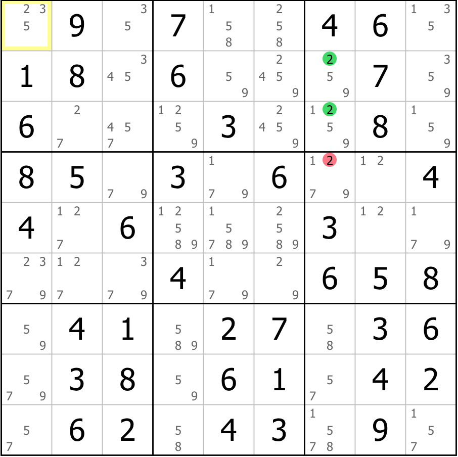
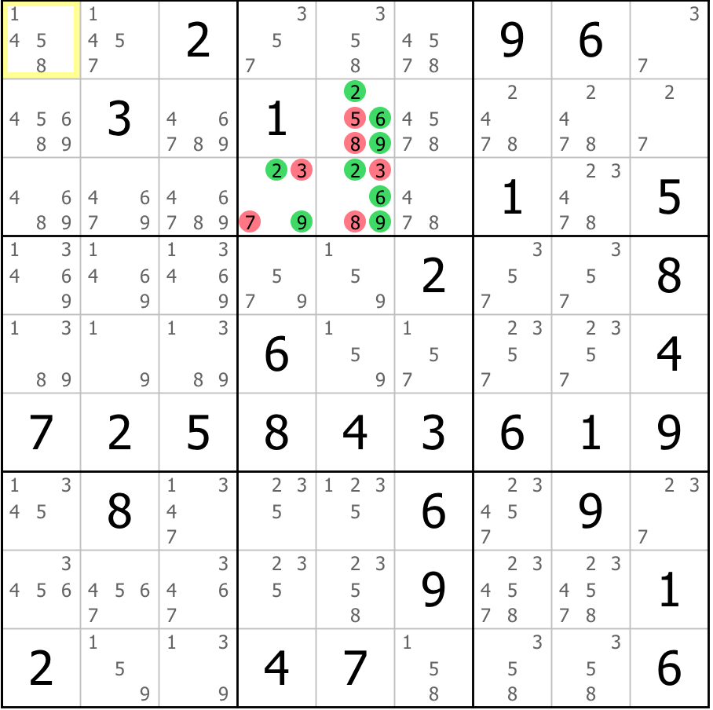
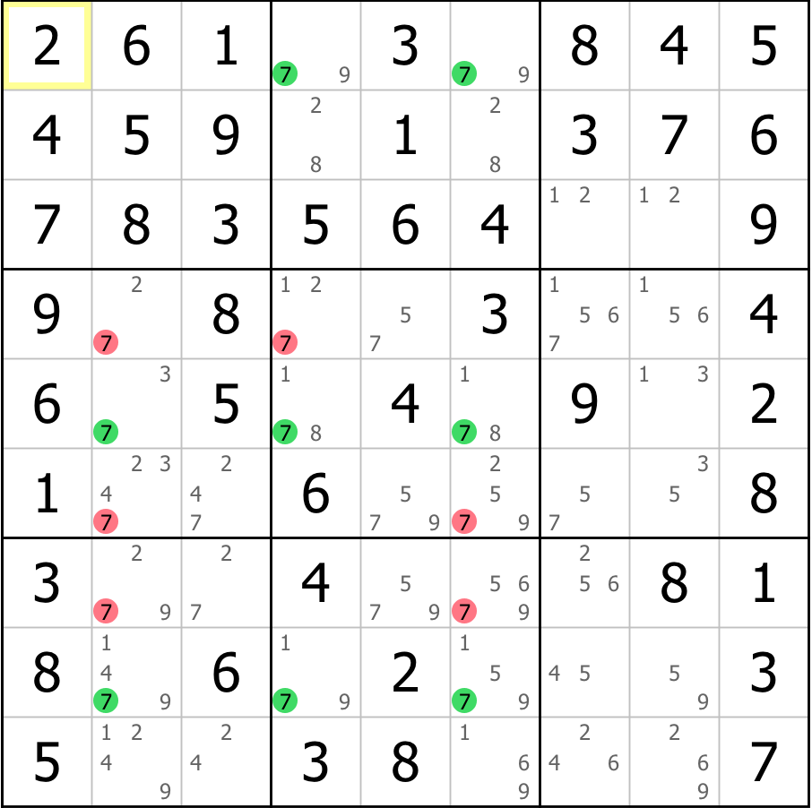

# rustdoku
Logical Sudoku solver in Rust.

**NOTE**: I am not in the slightest bit interested in solving *every* Sudoku puzzle. What I am interested in doing here is in building up a repertoire of logical techniques and patterns that are capable of solving the vast majority of even very difficult puzzles.

Many of these techniques will be infeasible for human solvers, but human solving is not the goal here. My aim is to develop a small set of heuristics that can be used to find logical solutions to Sudoku puzzles which meet two goals:

* The solve should be linear - it can be followed step-by-step without having to remember previous steps.

* The solve must be verifiable by a human with sufficient understanding of the techniques involved.

# Patterns included so far

Screenshots produced using the free software [HoDoKu](http://hodoku.sourceforge.net/en/index.php)

## Full house

This occurs when only one cell in a row, column or block remains empty. Although this is subsumed by both other types of single below, it's much easier to spot than the general case.

In this example, there is only one empty cell in the third column, into which the value 2 can be placed.

## Hidden single

This occurs when a particular value can only go in one position within a region (row, column or block).

In this grid, the only position in the top-left block that can hold the value 1 is r1c2.

## Naked single

When a cell can only hold a single value, that value can be placed in the cell.

In this grid, r4c6 can only take the value 7.

## Pointing

When all cells within a block that can hold a particular value also share a row or column, that value can be eliminated from other cells in that row / column.

In this example puzzle, all occurrences of the digit 2 within the third block are also in column 7. This means that the candidate 2 can be eliminated from R4C7.

## Claiming

When all cells within a row or column that can hold a particular value also share a block, that value can be eliminated from other cells in that block.

In this example, all occurrences of the digit 3 within row 6 lie within the central block, so the other occurrences of 3 within that block can be removed.

## Naked subsets

When a group of n cells within a single region have, between them, only n candidates, we can conclude that they must hold those candidates in some order, and so eliminate them from the rest of the region.

In this grid, cells r2c4, r3c4 and r7c4 contain between them the values 1, 5 and 6. This means that these values can be eliminated from the rest of the column.

## Hidden subsets

When there is a region such that a group of n values can, between them, only appear in n cells, those values must go in those cells and so other values can be eliminated from the cells in question.

In this puzzle, in block 2, the values 2, 6 and 9 can only appear in cells r2c5, r3c4 and r3c5. This means that other values can be removed from those cells.

## Fish (X-Wing, Swordfish, Jellyfish)

When there is a set of n rows or n columns (called the base sets) such that all occurrences of a particular digit within those sets line up within n columns or n rows respectively (the cover sets), then all occurrences of the digit within the cover sets which are not in the base can be eliminated - otherwise we would not be able to fit enough copies of the digit into the base sets overall.

In this example grid, the positions of the digit 7 within three rows (shown in green) are all contained in 3 columns. The eliminations from the rest of those columns are shown in red.

A fish with 2 base sets is called an X-Wing; with 3 it is a Swordfish; with 4, it is a Jellyfish.

## Finned fish

It is not often that a fish works out perfectly - sometimes there are positions left over which are not covered by the cover sets. These positions are called fins. In a finned fish, the normal fish eliminations are only valid if they are also within sight of every fin.

In this puzzle, there is a finned X-Wing on the digit 7. The 7's within columns 3 and 6 (shown in green) form the base of the fish, and the cover sets are rows 6 and 7. Normally, we could eliminate all the 7's in these rows, but there is a fin in r5c6. This means that only the eliminations which can see the fin are valid, while all the candidates in the rest of the rows may still be true.

## XY-Wing

The XY-Wing is a pattern involving 3 bi-value cells: the *pivot*, with candidates XY, and two pincers in sight of the pivot, one with candidates XZ and one with candidates YZ. Whatever is in the pivot, Z must appear in one of the pincers, so all cells that can see both pincers can have Z removed from them.

In this grid, the pivot candidates are shown in green and the pincers in yellow. Together, they eliminate 6 from r6c1 and r5c5.

## XYZ-Wing

The XYZ-Wing is very similar to the XY-Wing - it differs only in that the pivot cell also contains the digit Z. That is, we have a pivot cell with candidates XYZ, and two pincers, in sight of the pivot, with candidates XZ and YZ. Then, whatever is in the pivot, one of the three cells must contain Z, so Z can be eliminated from all cells that see all three of them.

In this example, the pivot in r7c9 and the pincers in r7c3 and r9c9 contribute to the elimination of 6 from r7c7.

## W-Wing

The W-Wing is a technique that applies when there are two cells, each with exactly the same two candidates A and B. If there is a region such that all possible occurrences of A within that region are within sight of one of these two cells, then it cannot be the case that both the cells contain A - this would leave nowhere to place A in the region!

This means that if we can find such a region, it must be the case that one of the two cells contains B, and so we can eliminate B from all common neighbours of the two cells.

In this example, the bivalue 1/9 cells r1c7 and r2c1 cover all of the candidate 1s in row 3. This means that 9 can be eliminated from r2c7.